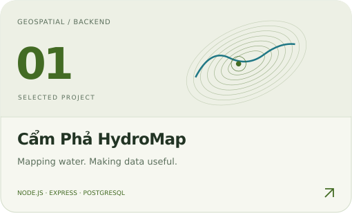
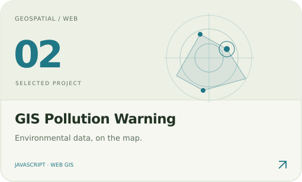
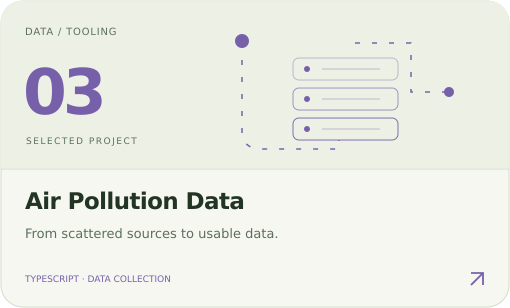
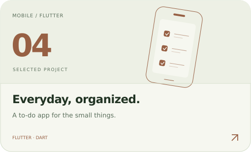
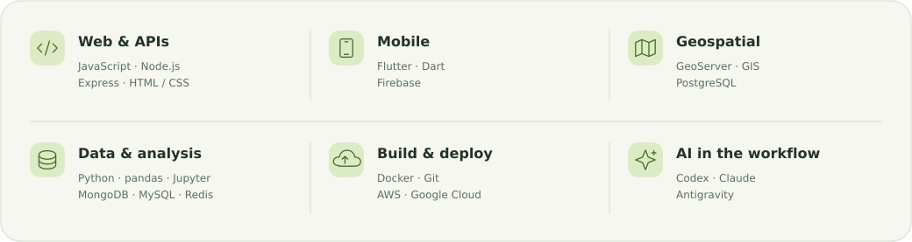

<picture>
  <source media="(max-width: 600px) and (prefers-color-scheme: dark)" srcset="assets/banner-mobile-dark.svg">
  <source media="(max-width: 600px)" srcset="assets/banner-mobile-light.svg">
  <source media="(prefers-color-scheme: dark)" srcset="assets/banner-dark.svg">
  
</picture>

  <b>Freelance software developer.</b> I build web apps, mobile experiences, 
  and tools that make geographic data useful.

<picture>
  <source media="(max-width: 600px) and (prefers-color-scheme: dark)" srcset="assets/section-work-mobile-dark.svg">
  <source media="(max-width: 600px)" srcset="assets/section-work-mobile-light.svg">
  <source media="(prefers-color-scheme: dark)" srcset="assets/section-work-dark.svg">
  
</picture>

<a href="https://github.com/sunsunit2k3/server-campha">
<picture>
  <source media="(max-width: 600px) and (prefers-color-scheme: dark)" srcset="assets/project-hydromap-mobile-dark.svg">
  <source media="(max-width: 600px)" srcset="assets/project-hydromap-mobile-light.svg">
  <source media="(prefers-color-scheme: dark)" srcset="assets/project-hydromap-dark.svg">
  
</picture>
</a>
<a href="https://github.com/sunsunit2k3/gis-web-pollution-warning">
<picture>
  <source media="(max-width: 600px) and (prefers-color-scheme: dark)" srcset="assets/project-pollution-mobile-dark.svg">
  <source media="(max-width: 600px)" srcset="assets/project-pollution-mobile-light.svg">
  <source media="(prefers-color-scheme: dark)" srcset="assets/project-pollution-dark.svg">
  
</picture>
</a>

<a href="https://github.com/sunsunit2k3/crawl_data_air_pollution">
<picture>
  <source media="(max-width: 600px) and (prefers-color-scheme: dark)" srcset="assets/project-air-data-mobile-dark.svg">
  <source media="(max-width: 600px)" srcset="assets/project-air-data-mobile-light.svg">
  <source media="(prefers-color-scheme: dark)" srcset="assets/project-air-data-dark.svg">
  
</picture>
</a>
<a href="https://github.com/sunsunit2k3/flutter_todo_user">
<picture>
  <source media="(max-width: 600px) and (prefers-color-scheme: dark)" srcset="assets/project-flutter-mobile-dark.svg">
  <source media="(max-width: 600px)" srcset="assets/project-flutter-mobile-light.svg">
  <source media="(prefers-color-scheme: dark)" srcset="assets/project-flutter-dark.svg">
  
</picture>
</a>

<picture>
  <source media="(max-width: 600px) and (prefers-color-scheme: dark)" srcset="assets/section-stack-mobile-dark.svg">
  <source media="(max-width: 600px)" srcset="assets/section-stack-mobile-light.svg">
  <source media="(prefers-color-scheme: dark)" srcset="assets/section-stack-dark.svg">
  
</picture>

<picture>
  <source media="(max-width: 600px) and (prefers-color-scheme: dark)" srcset="assets/toolkit-mobile-dark.svg">
  <source media="(max-width: 600px)" srcset="assets/toolkit-mobile-light.svg">
  <source media="(prefers-color-scheme: dark)" srcset="assets/toolkit-dark.svg">
  
</picture>

<picture>
  <source media="(max-width: 600px) and (prefers-color-scheme: dark)" srcset="assets/section-metrics-mobile-dark.svg">
  <source media="(max-width: 600px)" srcset="assets/section-metrics-mobile-light.svg">
  <source media="(prefers-color-scheme: dark)" srcset="assets/section-metrics-dark.svg">
  
</picture>

<picture>
  <source media="(max-width: 600px) and (prefers-color-scheme: dark)" srcset="assets/metrics-mobile-dark.svg">
  <source media="(max-width: 600px)" srcset="assets/metrics-mobile-light.svg">
  <source media="(prefers-color-scheme: dark)" srcset="assets/metrics-dark.svg">
  
</picture>

About these numbers

Public repositories only. Stars and forks received are counted on non-fork repositories. Language proportions count each non-fork repository's primary language; they do not measure skill level or lines of code.

[View the data](assets/metrics.json) · [How the profile updates](docs/profile-maintenance.md)

<a href="https://github.com/sunsunit2k3?tab=repositories">
<picture>
  <source media="(max-width: 600px) and (prefers-color-scheme: dark)" srcset="assets/footer-mobile-dark.svg">
  <source media="(max-width: 600px)" srcset="assets/footer-mobile-light.svg">
  <source media="(prefers-color-scheme: dark)" srcset="assets/footer-dark.svg">
  
</picture>
</a>
