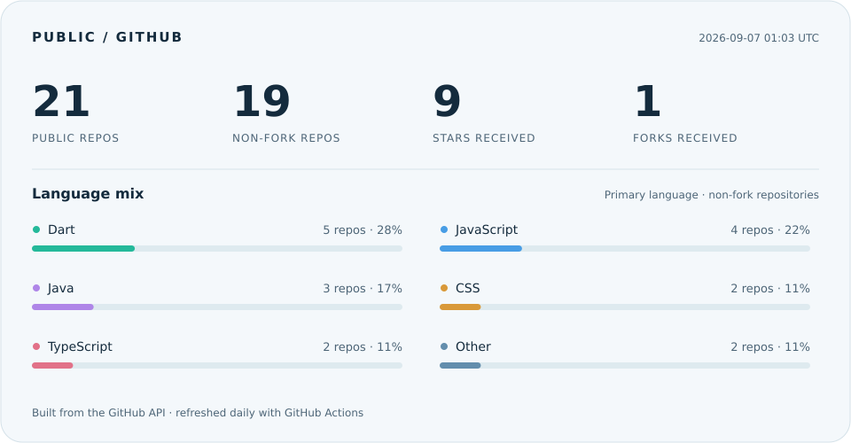

<picture>
  <source media="(prefers-color-scheme: dark)" srcset="assets/banner-dark.svg">
  
</picture>

### Xin chào, I'm Long 👋

Freelance software developer based in **Hanoi, Vietnam**. I build web applications, mobile experiences, and tools that make geographic data useful.

- **Web & APIs** — JavaScript, Node.js, Express.
- **Mobile** — Flutter and Dart.
- **Maps & data** — GIS, GeoServer, PostgreSQL, and Python.
- **AI-assisted development** — Codex, Claude, and Antigravity.

### Selected work

| Project | Focus |
| :--- | :--- |
| [Cẩm Phả HydroMap API](https://github.com/sunsunit2k3/server-campha) | Node.js / Express API for the Cẩm Phả HydroMap project. |
| [GIS pollution warning](https://github.com/sunsunit2k3/gis-web-pollution-warning) | A JavaScript web GIS project for pollution warnings. |
| [Air pollution data](https://github.com/sunsunit2k3/crawl_data_air_pollution) | TypeScript tooling for collecting air pollution data. |
| [Flutter to-do app](https://github.com/sunsunit2k3/flutter_todo_user) | A mobile to-do project built with Dart and Flutter. |

### Toolbox

| Layer | Technologies |
| :--- | :--- |
| Languages | JavaScript · Dart · Python · HTML / CSS |
| Backend | Node.js · Express |
| Mobile | Flutter · Firebase |
| Data | PostgreSQL · MongoDB · MySQL · Redis |
| Infrastructure | Docker · AWS · Google Cloud · Git |
| Geospatial & analysis | GeoServer · Jupyter · pandas |

### GitHub, in numbers

<picture>
  <source media="(prefers-color-scheme: dark)" srcset="assets/metrics-dark.svg">
  
</picture>

Public repositories only. Stars and forks received are counted on non-fork repositories. Language bars count each non-fork repository's primary language, not skill level or lines of code.

---

[Explore my repositories →](https://github.com/sunsunit2k3?tab=repositories) · [How this profile updates](docs/profile-maintenance.md)
